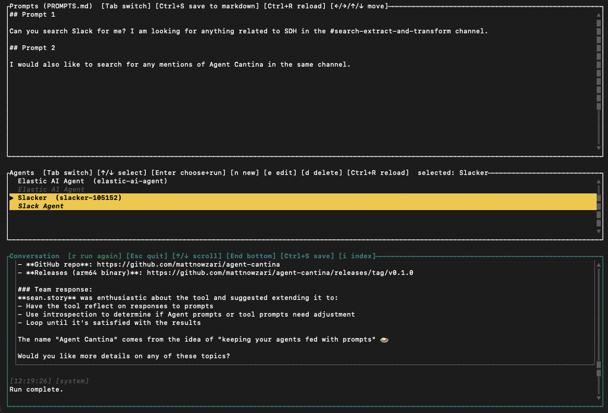
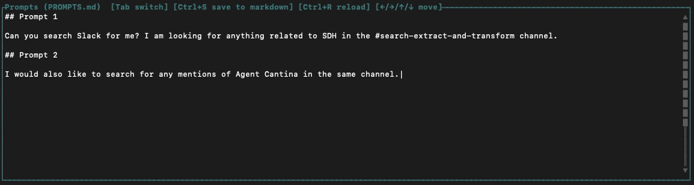
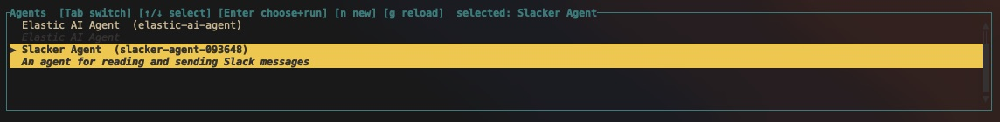
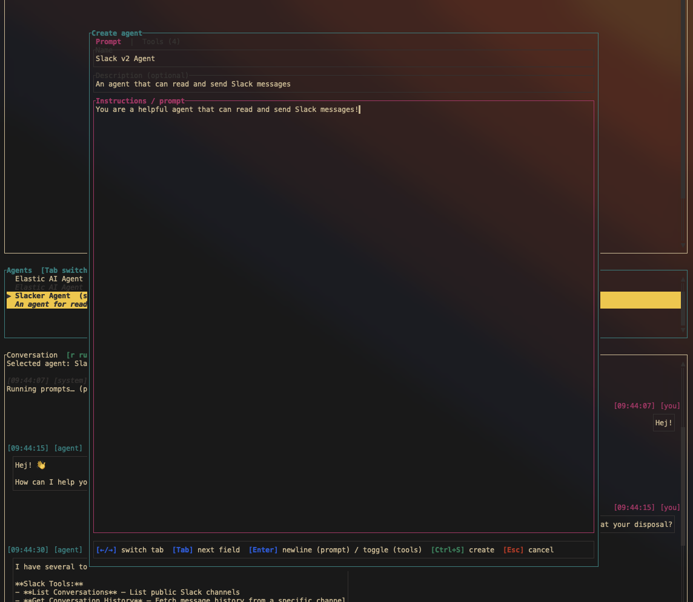
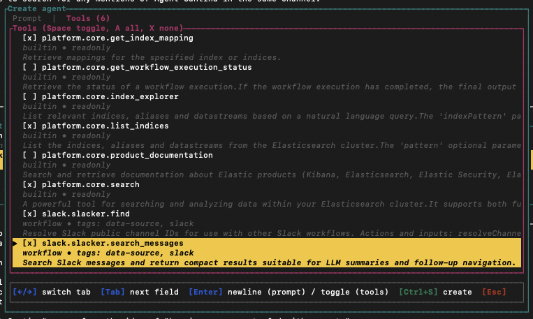
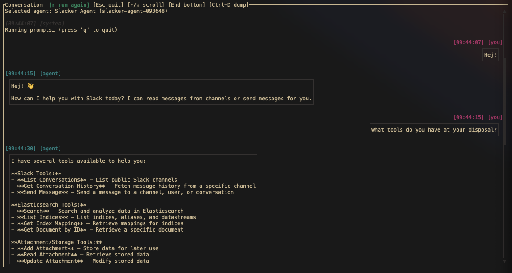

# Agent Cantina
### _"Keep your Agents fed with prompts!"_

## What is Agent Cantina?

Agent Cantina is a TUI tool for Elastic Agent Builder developers.

With it, you can:
- Load, edit and save a series of individual prompts from a `PROMPTS.md` file.
- Run an automatic chat session against an Agent with the prompts in your `PROMPTS.md` file - no more manually chatting with an agent to verify something works!
- View all existing Agents in the Kibana instance, and create brand new ones with assigned tools.



## Who is this tool for?

This tool is for developers who require repeatable chat sessions while developing or modifying:

- [Custom Agents](https://www.elastic.co/docs/explore-analyze/ai-features/agent-builder/agent-builder-agents#custom-agents)
- [Tools](https://www.elastic.co/docs/explore-analyze/ai-features/agent-builder/tools)
- [Workflows](https://www.elastic.co/docs/explore-analyze/workflows)

## How to get started

You can download a Mac-compatible binary under the Releases page.

Agent Cantina requires your Kibana URL and API key to be set as environment variables.

```shell
export KIBANA_URL=<your-kibana-url>
export ES_HOST=<your-elasticsearch-url> # optional, only necessary if you want to index chat sessions
export API_KEY=<your-api-key>

# alternatively, you can create an .env file and Agent Cantina will pick up the environment variables from there

cat > .env <<'EOF'
KIBANA_URL=<your-kibana-url>
ES_HOST=<your-elasticsearch-url>
API_KEY=<your-api-key>
EOF

./agent_cantina
```

### Kibana HTTPS / self-signed certs (local dev)

If you start Kibana locally with `--ssl`, it typically uses a self-signed certificate (and may have a hostname like `CN=kibana` while you connect to `https://localhost:5601`). In that case, Agent Cantina may fail to connect unless your OS trusts the certificate.

For **local development only**, you can bypass TLS verification:

```shell
export KIBANA_INSECURE_TLS=1
```

## Tutorial

There are three "panels" in Agent Cantina:

- Prompts
- Agents
- Conversation

Each panel serves a specific purpose, and has its own set of unique actions.

You can cycle through the current "active" panel with the `Tab` key.

### The Prompts panel and `PROMPTS.md`
This is where you can view and edit your `PROMPTS.md` file. If no `PROMPTS.md` is present, Agent Cantina will create a basic one for you and load it.



> A note on formatting - `PROMPTS.md` needs to follow a _very_ specific format:
```
## Prompt 1

<your-first-prompt-here>

## Prompt 2

<your-second-prompt-here>

etc...
```

Special actions available in the Prompts panel:

- `Ctrl-S`: Save any edits to `PROMPTS.md`
- `Ctrl-R`: Reload the `PROMPTS.md` from disk

### The Agents panel

This is where you can select an Agent to send your prompts to.



All agents that are configured in Agent Builder will appear here. Use the `Up/Down` arrows to choose an Agent, and `Enter` to begin a chat session with it.

Special actions available in the Agents panel:

- `n`: Create a brand new Agent from within Agent Cantina
- `Ctrl-R`: Reload the list of agents from Agent Builder

### Creating a brand-new agent from within Agent Cantina

You can create a new agent by hitting `n` in the Agents panel. This will open a new popup window with two tabs, `Prompt` and `Tools`.



In the `Prompt` tab, you can set:

- `Name`
- `Description (optional)`
- `Instructions / prompt`

Use the `Tab` key to switch between each field in the `Prompt` tab.

Use the `Left/Right` arrows to switch between the `Prompt` and `Tools` tabs. In the `Tools` tab, use the `Up/Down` and `Enter` keys to select which tools the Agent should be configured with.

When you are done configuring your agent, use `Ctrl-S` to create your Agent!

Once you Agent has been created, you can go back and edit it by hitting `e` from within the Agents panel.




### The Conversation panel

This is where you can see the chat session prompts and responses, as well as system messages.



Special actions available in the Conversations panel:

- `r`: Re-run the chat session (good if you make edits to your `PROMPTS.md` and need to try again)
- `End`: Go to the bottom of the chat window (latest message)
- `Ctrl-S`: Dump the entire chat history into a Markdown file (written to the current working directory)
- `i`: Index your chat history into an Elasticsearch index

> Cool thing to try - all three panels will respond to mouse scrolling input!

## Building from source

Prior to building, make sure you have [Rust installed](https://rust-lang.org/learn/get-started/). This application was developed with `rustc 1.91.0`. It _may_ build with older versions, but I haven't tested this.

```shell
make build # for debug builds
make build-release # for release builds
```

## FAQ

- **Question**: Every chat run I perform creates a new chat session in Agent Builder. Is there any way I can add new prompts and resume an existing chat session?

  - **Answer**: Not at this time. This is an improvement I'd like to make!

- **Question**: Editing my `PROMPTS.md` in the editing window is kinda slow!

  - **Answer**: Yeah, it's good for small edits and tweaks, but you probably shouldn't write the entire thing there. That's what `Ctrl+R` is for - you can make edits in your own text editor, save it, then reload the `PROMPTS.md` file!

- **Question**: The color theme doesn't look good on my particular terminal?

  - **Answer**: The theme is based on Elastic's colorway, and is defined in `theme.rs`. You can always change it up to suit your particular terminal or preferences! You'll have to re-build the executable, though. This may turn into a YAML file or something later, who knows?

- **Question**: Was this vibecoded?
  - **Answer**: 100%. As an enthusiast of the Rust language, I really wanted to write this one by hand, but I just don't have enough hours in the day to write tooling on top of feature work :(

## Feature wishlist/To-dos (in no particular order)

- Possibly improve the `PROMPTS.md` required formatting to be less verbose
- When dumping to markdown, it should save to a configurable directory
- Ability to load different Markdown files via a file browser-type interface
- Implement some basic error logging
- Track conversation IDs so certain conversations can be resumed, even after Agent Cantina is exited and started again
